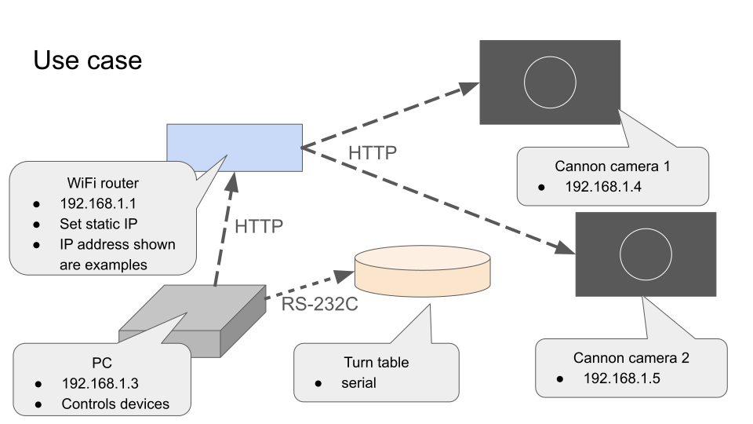
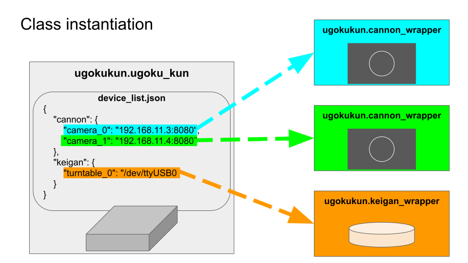

Overview
========

Quickstart
----------

If you're in a hurry, see `the readme_demo in the GitHub repo <https://github.com/qwasium/ugoku-kun/tree/main/readme_demo>`_.

It will cover the basics.

Workflow
--------

An example of the system setup for Ugoku-kun will look like this:

Check the IP address of the camera(s) and the serial port address of the turntable.
You will need it.

Cannon camera can operate as an wifi access point, but if you have multiple cameras, use a dedicated router.
It is a good idea to set up a static IP address for the camera(s).

The main Workflow is as follows:

#. Create ``task csv`` and ``device json`` (explained below).
#. Set up camera(s) and turntable. Check or set addresses.
#. Adjust focus on camera(s). Some camera features can only be set physically.
#. Run Jupyter Notebook as in the Quickstart.
#. Wait for the process to finish. Note that if there are any errors, it will stop the entire process.
#. Check log file.

You will need to create a ``task csv`` and ``device json`` file first.

* For ``task csv``, see the :doc:`Task CSV <task_csv>` section.
* For ``device json``, read on below.

Device List JSON
----------------

All devices are identified by a unique ID.
This ID is also used to refer to the device in the task CSV.

The JSON file should be structured as follows:

.. code-block:: javascript

    {
        "cannon": {
            "some_unique_camera_id": "ip_address:port",
            "another_unique_camera_id": "ip_address:port",
            ...
        },
        "keigan": {
            "some_unique_turntable_id": "serial_port_address"
        }
    }

See `readme_demo in the GitHub repo <https://github.com/qwasium/ugoku-kun/tree/main/readme_demo>`_ for an example.

If using only camera(s) and no turntable, keep the ``keigan`` key with empty value: ``"keigan": {}``.

Eace device defined in the JSON file will create an instance of the corresponding class.

The ``task csv`` will execute against targets defined in the JSON file.

Network Configuration
---------------------

When using multiple cameras, a dedicated router will be necessary.
There are some important settings to consider when setting up the network.

**Important**: Inappropriate settings can lead to connection issues.

Kill any *smart* features on your router that automatically adjusts configurations such as the following:

* Don't mix authentication methods.
    * If in doubt, use **WPA2-PSK (AES) ONLY**.
* Don't mix 2.4/5GHz bands.
    * Set a **dedicated SSID for 2.4GHz**.
* Don't mix channel width (20MHz/40MHz).
    * Set to either **20MHz ONLY or 40MHz ONLY**.
* Use channels 1-11 only.
    * Auto channel selection is OK as long as **12/13 channels are disabled**.

Limitations
-----------

ccapi
^^^^^

ccapi cannot get the setting values when set to "auto". It will just return "auto".
Also, getting file information needs some effort and I couldn't implement it yet.
It would be nice to at least get the file name of any photo taken.

pykeigan
^^^^^^^^

Though any official API is appreciated, pykeigan is not well documented so it is easier to read the source code to understand how to use it.
The software design is based on using it as a CLI tool, where the user is expected to read the console output and terminate the process via Ctrl+C when necessary.
Thus, methods won't return any useful information and reading attributes are also not that useful.
Subroutines can easily lead to non-terminating processes making it hard to handle with Python.
Anyone who wants to use this library in a serious production environment should fork the repository and make the necessary changes to the source code.

Future Support
^^^^^^^^^^^^^^

I do NOT own any hardware myself.
Unfortunately, support for this project will be limited.
If you are interested in forking this project, please let me know.
I will reference your fork on this documentation so others can be aware of it.